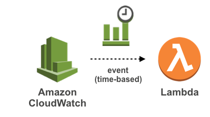

# Apex Commit Alarm

Application for oneday's commit count alarm to mail



## Getting Started
```zsh
$ git clone https://github.com/LuceteYang/apex-commit-alarm.git your-project-name
$ cd your-project-name
# edit gmail github account project.json role
$ pip install apex
$ apex deploy production

```

## Reference
1. https://github.com/phillyai/commit-twitter-bot
2. https://github.com/geekhub-lab/commit-alarm
3. https://mingrammer.com/dev-commit-alarm-bot/